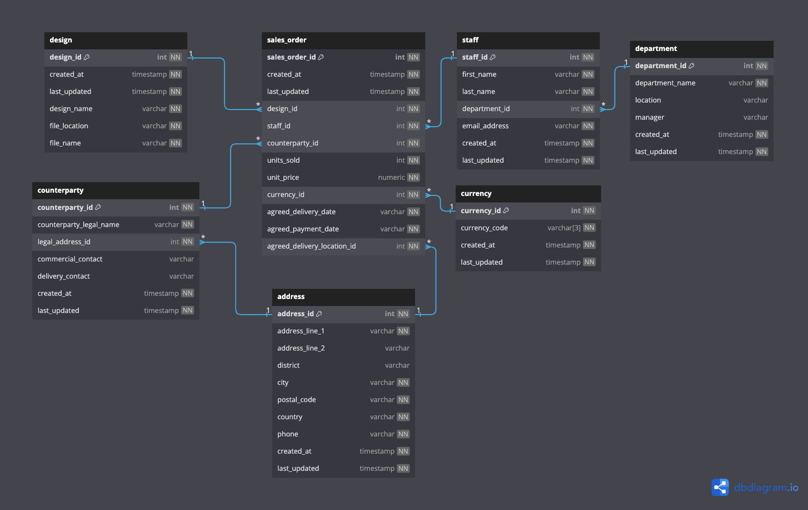
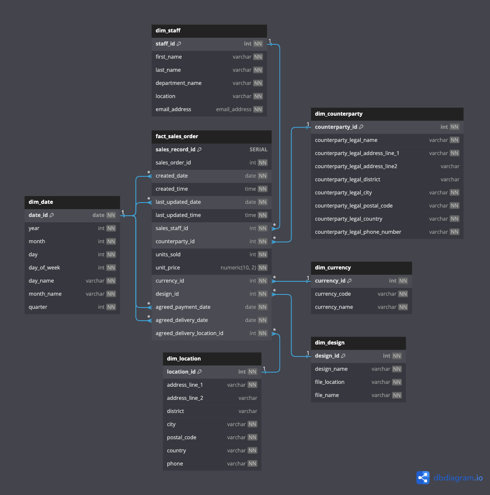
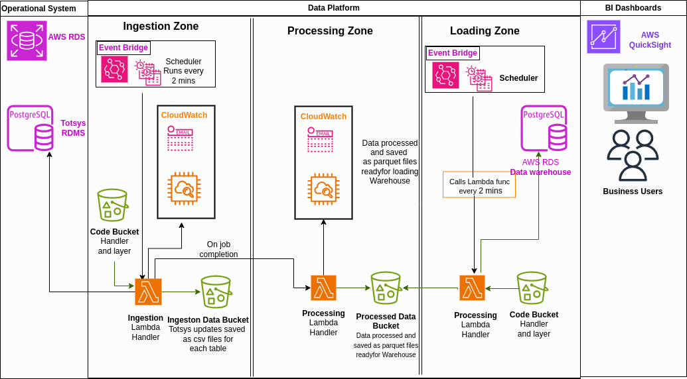

# Marble - Data Engineering Project #
Project link: https://github.com/RadGuav/Final-Project
____
This project encapsulates a series of applications which interact with AWS and database infrastructure, manipulating table data to fit the target schema, and loading it into a data warehouse. The aim of this project is to display proficiency and confidence in working with data pipelines and adjacent programmatic concepts. Infrastructure such as that provided here has the potential to play crucial roles in enhancing data accessibility and analytical capabilities, enabling more informed decision-making within organisations.

For more information regarding the project specifications, please refer to the _project_spec.md_ file included in this repository.

**Read this document carefully - it contains information about the completed Minimum Viable Product (MVP).**

## Table of Contents

[Features Overview](#features-overview)

[Setup](#setup)

[How does it work?](#how-does-it-work)

[Diagrams and Schema](#diagrams-and-schema)

## Features Overview 

This document provides an overview of the successfully implemented features and components.

1. S3 Buckets:
- Ingestion Bucket:
    - All ingested data is stored here.
    - Data is organised by year, month, date and table.

- Processed Bucket:
    - Processed data transformed for the data warehouse is stored here.
    - Data is organized based on the warehouse schema.

2. Ingestion Application:
- Python Application deployed in AWS Lambda:
    - Continuously ingests tables from the totesys database.
    - Operates automatically on a schedule.
    - Progress is logged to CloudWatch.
    - Email alerts are triggered in case of failures.
    - Adheres to good security practices.

3. Data Remodeling Application:
- Python Application deployed in AWS Lambda:
    - Remodels data into a predefined schema for the data warehouse.
    - Stores data in Parquet format in the "processed" S3 bucket.
    - Automatically triggers upon completion of an ingested data job.
    - Provides adequate logging and monitoring.

4. Data Loading Application:
- Python Application deployed in AWS Lambda:
    - Loads data into the data warehouse at defined intervals.
    - Provides adequate logging and monitoring.

5. Data Warehouse:
- Star Schema Tables Populated:
    - Fact Tables: fact_sales_order
    - Dimension Tables: dim_staff, dim_location, dim_design, dim_date, dim_currency, dim_counterparty.

6. Testing and Compliance
- Code Quality Assurance:
    - Python code thoroughly tested and PEP8 compliant.
    - Security vulnerabilities checked using safety and bandit packages.
    - Test coverage exceeds 95%.

7. Automation
- Infrastructure Deployment:
    - Requirements installation, security checks and tests on application code use Makefile scripts.
    - Deployment scripts use Terraform.
    - Automated deployment using CI/CD techniques in GitHub Actions.
    - AWS Eventbridge schedules ingestion job checks for changes frequently.

## Setup 

- Clone the repository:

        - git clone https://github.com/RadGuav/Final-Project.git
        - cd Final-Project

- Set up a virtual environment:

        - python -m venv venv
        - source venv/bin/activate

- Install dependencies:

        - pip install -r lambda_requirements.txt -t ./layer/python
        - pip install -r lambda_requirements_2.txt -t ./layer_2/python
        - make requirements

- Deploy using Terraform:

        - cd terraform
        - terraform init
        - terraform plan
        - terraform apply

- You're all set! After a few minutes, the data will be ingested, processed, and loaded into the database in the required schema. You can now query the database to retrieve any information you might need.

## How does it work? 

__Ingestion application:__

This python application runs on a schedule in AWS Lambda, and performs the following:

- Connects to source database using pg8000, retrieving required credentials from the Secrets Manager service in AWS;

    - __Note__: You will need to set up your own secret credentials in AWS Secrets Manager, and ensure that the code in _src/ingestion/connection.py_ makes reference to the correct secret.

- Queries the source database to retrieve all available table names. This scales dynamically for any number of tables in the database;

- Checks if there are already files associated with the database tables stored in the S3 "ingestion" bucket. If not, performs an initial pull of all that table's data;

- Reads each of the available tables' contents, and checks if there are differences between the database data and the associated data stored in the S3 "ingestion" bucket. If there are, only updated rows are fetched;

- Converts the retrieved data to CSV format using the pandas module;

- Uploads to S3 "ingestion" bucket with filepath in the form:

        year/month/day/table_name/upload_time.csv

- Logs relevant information and handles errors gracefully.

__Processing application:__

This python application runs on a trigger when an object is put in the "ingestion" bucket in AWS Lambda, and performs the following for that object:

- Checks that the file data is for an expected table associated with the source database;

- Processes the file contents to fit the target database schema:
    - Reassigns table columns as necessary,
    - Creates merged tables where appropriate,
    - Adds required columns and calculates any associated values.

- Converts resulting dimension and fact tables to Parquet format;

- Uploads to S3 "processed" bucket with filepath in the form:

        year/month/day/processed_table_name/upload_time.parquet

- Additionally, checks if there is a "dim_date" file in the "processed" bucket. If not, creates and uploads this table file containing rows for every date within a given range;

- Logs relevant information and handles errors gracefully.

__Loading application:__

This python application runs on a schedule in AWS Lambda, and performs the following:

- Connects to the target database using psycopg2 module, retrieving required credentials from the Secrets Manager service in AWS;

    - __Note__: You will need to set up your own secret credentials in AWS Secrets Manager, and ensure that the code in _src/ingestion/connection.py_ makes reference to the correct secret.

- Queries the target database to retrieve all available table names with their associated primary keys. This scales dynamically for any number of tables in the database;

- Gets files from S3 "processed" bucket and reads Parquet contents, tagging retrieved files as such to avoid inserting duplicate data;

- Inserts table data into associated table in target database using psycopg2 SQL methods;

- Logs relevant information and handles errors gracefully.

## Diagrams and Schema 

__Source schema:__

__Target schema:__

__ETL Diagram:__

